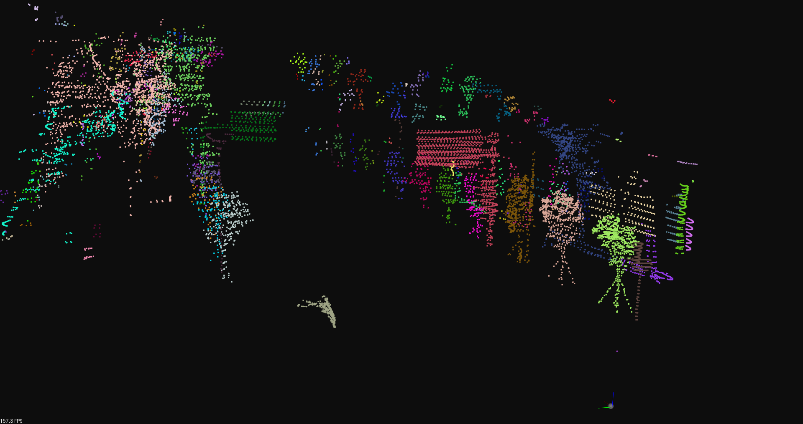

# 📝 c++ generic DBSCAN #
***

- c++ generic dbscan library on CPU & GPU. header-only codes for cpu dbscan.
- cpu dbscan uses kd-tree for radius search.
- gpu dbscan or [G-DBSCAN](https://reader.elsevier.com/reader/sd/pii/S1877050913003438?token=E033ECA84C7B1F55917A637A014A22704BAE63308219758D0D58A96E341DB7C8FF05EE97208D877494577F20ED0226D8&originRegion=us-east-1&originCreation=20211003151554) uses BFS on nodes of point.

## :tada: TODO ##
***

- [x] Implement generic kd-tree
- [x] Implement generic dbscan
- [x] Create unittest & examples
- [x] GPU DBSCAN

## 🎛  Dependencies ##
***

- base dependencies

```bash
sudo apt-get install \
    libpcl-dev \
```

*tested with pcl 1.10*

- gpu dbscan

 [CUDA toolkits](https://developer.nvidia.com/cuda-toolkit) (tested on cuda 11)

*lower pcl version (that uses older eigen version) might not be compatible with cuda*

## 🔨 How to Build ##
***

```bash
# build lib
make default -j`nproc`

# build examples

# build only cpu dbscan
make apps -j`nproc`

# build both cpu and gpu dbscan
make gpu_apps -j`nproc`
```

## :running: How to Run ##
***
- *This library provides an example with clustering point cloud from [livox horizon lidar](https://www.livoxtech.com/horizon)*

```bash
# after make apps or make gpu_apps

# cpu
./build/examples/test_pointcloud_clustering [path/to/pcl/file] [eps] [min/points]

# gpu

./build/examples/test_pointcloud_clustering_gpu [path/to/pcl/file] [eps] [min/points]

# eps and min points are parameters of dbscan algorithm

# for example
./build/examples/test_pointcloud_clustering ./data/street_no_ground.pcd 0.7 3

# or
./build/examples/test_pointcloud_clustering_gpu ./data/street_no_ground.pcd 0.7 3
```

- processing time (average of 10 tests):

```bash
# number of points: 11619
# processing time (cpu): 80[ms]
# processing time (gpu): 38[ms]

# difference in speed will get more obvious with point cloud of more points
```

- Here is the sample result:



## :gem: References ##
***

- [kdtree](https://en.wikipedia.org/wiki/K-d_tree)
- [dbscan](https://en.wikipedia.org/wiki/DBSCAN)
- [G-DBSCAN: A GPU Accelerated Algorithm for Density-based Clustering](https://www.sciencedirect.com/science/article/pii/S1877050913003438)
- [SLIC-DBSCAN-CUDA](https://github.com/ca1773130n/SLIC-DBSCAN-CUDA)
