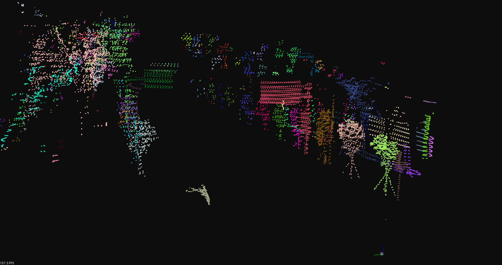

# 📝 c++ generic DBSCAN #
***

header-only c++ generic dbscan library. this library uses kd-tree for radius search.

## :tada: TODO ##
***

- [x] Implement generic kd-tree
- [x] Implement generic dbscan
- [x] Create unittest & examples

## 🎛  Dependencies ##
***
*pcl is needed only for building example. Also using omp is optional*

```bash
sudo apt-get install \
    libpcl-dev \
    libomp-dev \
```

## 🔨 How to Build ##
***

```bash
# build lib
make all -j`nproc`

# build unittest
make unittest -j`nproc`

# build examples
make apps -j`nproc`
```

## :running: How to Run ##
***
*This library provides an example with clustering point cloud from [livox horizon lidar](https://www.livoxtech.com/horizon)*

```bash
# after make apps
./build/examples/test_pointcloud_clustering [path/to/pcl/file] [eps] [min/points]
# eps and min points are parameters of dbscan algorithm

# for example
./build/examples/test_pointcloud_clustering ./data/street_no_ground.pcd 0.5 3
```

Here is the sample result:



## :gem: References ##
***

- [kdtree](https://en.wikipedia.org/wiki/K-d_tree)
- [dbscan](https://en.wikipedia.org/wiki/DBSCAN)
